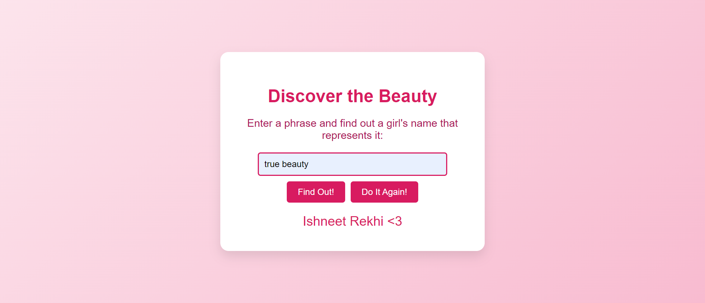

# Wingman-For-My-Friend

Hey! I had to do it for one of my closest friend, basically he wanted to impress her friend (the one whom he likes a lot).
This is a simple web application that allows users to input a phrase related to beauty, and it returns a corresponding girl's name. The application also handles specific inputs and provides a fun interaction. Additionally, there's a "Do It Again" button that lets users reset the form and try a new phrase.

## Demo



## Features

- **Input Normalization**: Handles inputs regardless of case sensitivity and ignores specific punctuation marks like `?`.
- **Customizable Phrases**: You can easily modify the list of phrases that trigger specific outputs.
- **Interactive Interface**: Users can easily reset and try different phrases using the "Do It Again" button.

## Technologies Used

- **HTML**: Structure of the webpage.
- **CSS**: Styling for the interface, including background, button styling, and layout.
- **JavaScript**: Handles form submission, input normalization, and dynamic updates of the page content.

## How to Use

1. Clone the repository:
    ```bash
    git clone https://github.com/ivarungupta/wingman-for-my-friend
    ```

2. Navigate to the project directory:
    ```bash
    cd wingman-for-my-friend
    ```

3. Open `index.html` in your preferred web browser.

4. Type a phrase related to beauty into the input box and click "Find Out".

5. If the phrase matches a predefined set, it will display the corresponding name. If not, it will suggest trying a different phrase.

6. Click "Do It Again" to reset the form and try a new phrase.

## Customization

To customize the phrases and their corresponding results:

- Open the `script.js` file.
- Modify the `validPhrases` array to add or remove phrases that return the result "Ishneet Rekhi <3".
- Modify the `vPhrases` array to add or remove phrases that return the result "Tanmay Tripathi Xd".

### Example:

```javascript
const validPhrases = [
    "what is beauty",
    "describe beauty",
    // Add more phrases here
];
```

### Notes:
- Replace `https://github.com/yourusername/beauty-phrase-finder.git` with your actual GitHub repository URL.
- Replace `email@example.com` with your contact email.
- You may need to add a screenshot of the project (`screenshot.png`) and a `LICENSE` file in your repository.
  
This README provides a clear overview of your project and guides users on how to use and customize it. Let me know if you need any more details!


### Thanks !!
